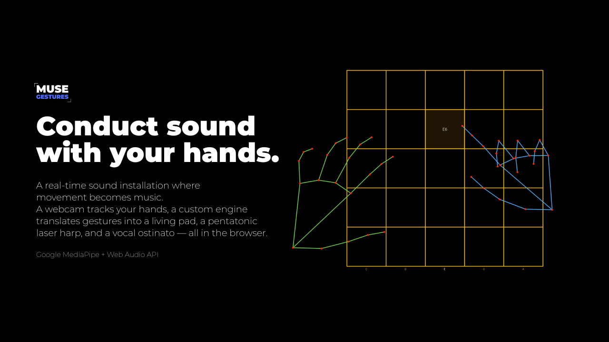

<h1 align="center">MUSE GESTURES</h1>

<p align="center">
  <sup>Real-time hand-controlled sound installation. Pure browser, no installation required.</sup>
</p>

<h4 align="center"><a href="https://musegestures.space">Try it yourself</a></h4>

<p align="center">
  <a href="https://musegestures.space">
    
  </a>
</p>

## The Idea

A webcam tracks your hands via MediaPipe. A custom Web Audio engine translates gestures into a living pad, a pentatonic laser harp, and a looped vocal ostinato — all synthesized in-browser, low-latency.

- **Left hand** sculpts the atmosphere: pad filter, vocal ostinato volume, reverb amount
- **Right hand** plays the melody: pentatonic 5×5 grid, delay/echo amount

## Tech stack

- **Framework**: Next.js 16 (App Router), TypeScript
- **Styling**: Tailwind CSS 4, `shadcn/ui`
- **Computer Vision**: `@mediapipe/tasks-vision` (Hand Tracking)
- **Audio**: Web Audio API (Custom modules: `AudioEngine`, `PadEngine`, `SamplePlayer`, `VoxPlayer`)
- **State Management**: Zustand

## Project structure

Here's a quick map of the codebase:

```
public/
  models/hand_landmarker.task     # MediaPipe model (7.5 MB, downloaded once)
  samples/
    manifest.json                 # List of samples
    musicbox.ogg  lofipiano.ogg   # Harp samples (selectable in UI)
    vox.ogg                       # Ostinato vocal sample (auto-loaded)
  gestures-guide/
    page-1.png                    # Gestures guide as embedded image
  gestures-guide.pdf              # Same, as downloadable PDF
src/
  app/
    layout.tsx                    # Fonts, metadata
    page.tsx                      # Landing ↔ play view switcher
  components/gesturcv/
    LandingPage.tsx               # Editorial landing
    CameraView.tsx                # <video> + canvas overlay + tracking loop
    SampleSelector.tsx            # Dropdown for harp sample selection
  lib/
    audio/
      AudioEngine.ts              # Top-level Web Audio graph
      PadEngine.ts                # Evolving pad (Draen "belong"-inspired)
      SamplePlayer.ts             # Polyphonic sample player with transposition
      VoxPlayer.ts                # Looping vocal ostinato
    handtracking/
      HandTracker.ts              # MediaPipe wrapper + temporal filter
      features.ts                 # Hand feature extraction (port from Python)
      LaserHarp.ts                # 5×5 grid state machine
      constants.ts                # Channel map, grid constants
    gesturcv-store.ts             # Zustand store (channels, harp, language, etc.)
    i18n.ts                       # Translations
```

## Roadmap

- [x] Core hand tracking + audio engine
- [x] Pentatonic laser harp (5x5 Grid) with delay
- [x] Looping vocal ostinato
- [x] EN/RU localization
- [ ] 6th gesture: right-hand pinch → tanpura strum
- [ ] Recording / looping performance
- [ ] More samples

## Local development

This project uses [Bun](https://bun.sh/) as the package manager and runtime.

```bash
# Clone the repo
git clone https://github.com/keithrosseau/muse-gestures.git
cd muse-gestures

# Install dependencies
bun install

# Start the dev server
bun run dev
```

Open http://localhost:3000

## Build for production

```bash
bun run build
bun run start
```


## License

MIT

<p align="center">‎ </p>
<p align="center">‎ </p> 
<p align="center">‎ </p> 
<p align="center">🤍🌞</p> 
